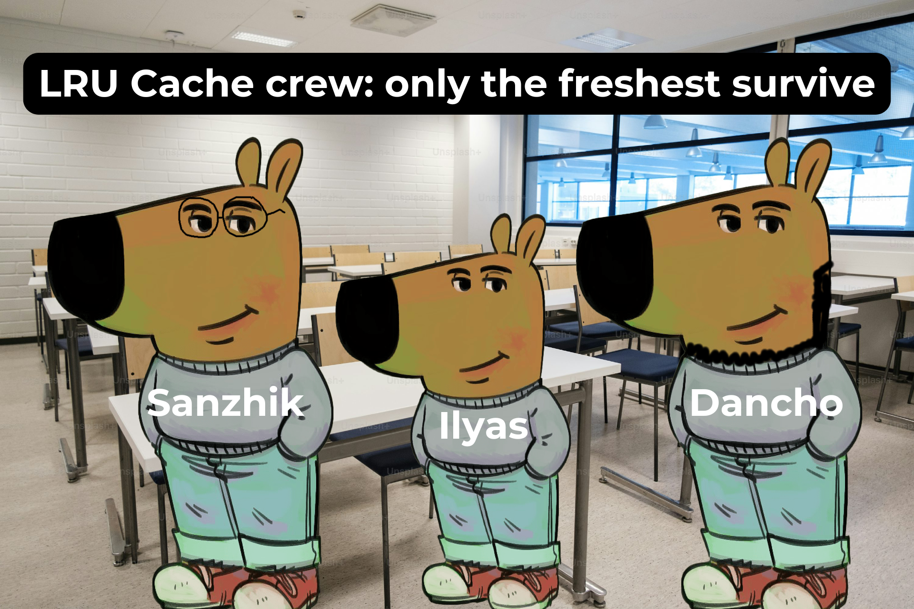
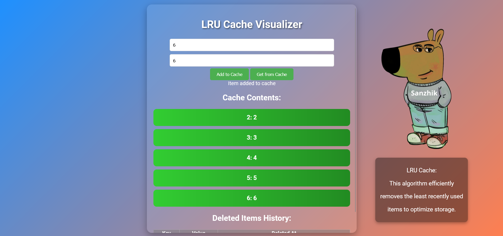

# LRU Cache Visualizer



---

## 🔍 О проекте
"LRU Cache Visualizer" — это учебный проект, который визуализирует работу алгоритма **LRU Cache** (Least Recently Used).  
Проект позволяет наглядно изучить, как работает механизм удаления наименее используемых элементов для оптимизации использования памяти.

**Особенности**:
- 🚀 Реализация алгоритма LRU Cache на Go.
- 🖥️ Интерактивный интерфейс для управления кэшем.
- 🎨 Плавные анимации для добавления и удаления данных.
- 🖼️ Мемы для настроения!

---

## 📷 Интерфейс



---

## 🛠️ Используемые технологии

- **Frontend**: HTML, CSS, JavaScript (Vanilla JS)
- **Backend**: Go (Gin Framework)
- **Анимации**: CSS Transition

---

## 📂 Структура проекта

LRU_Cache_Project/ │ ├── static/ │ ├── style.css # Основной стиль сайта │ ├── chillguy.png # Мем для LRU Cache │ ├── crew.png # Мемная команда LRU Cache │ ├── main.go # Backend на Go ├── README.md # Описание проекта


---

## 🚀 Как запустить проект

### 1. Установите зависимости
- Убедитесь, что у вас установлен **Go** (версии 1.18 и выше).
- Используйте любой современный браузер для интерфейса.

### 2. Запустите сервер
Выполните следующую команду в терминале:
```bash
go run main.go

